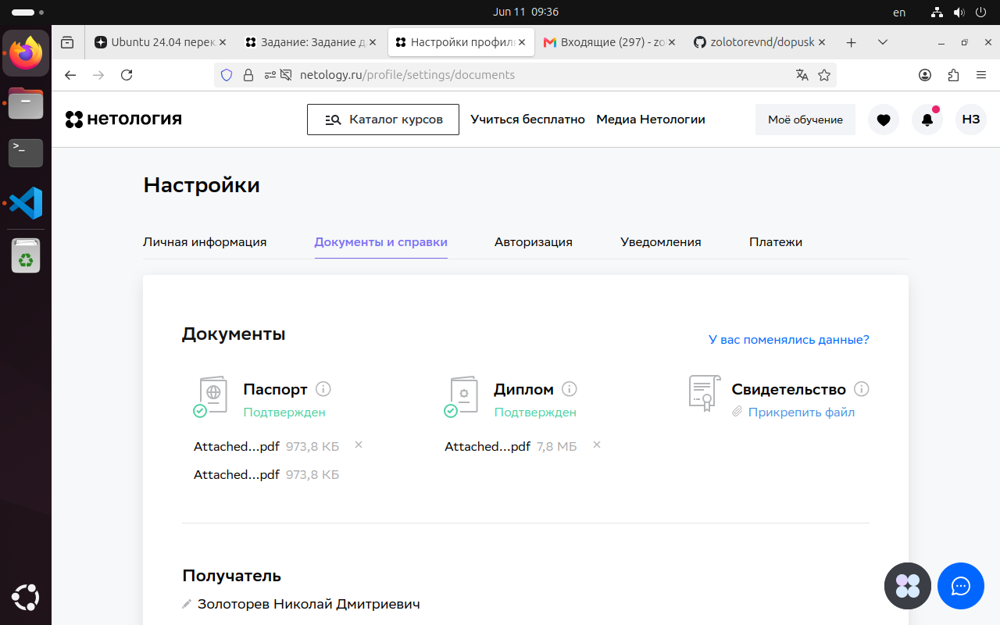
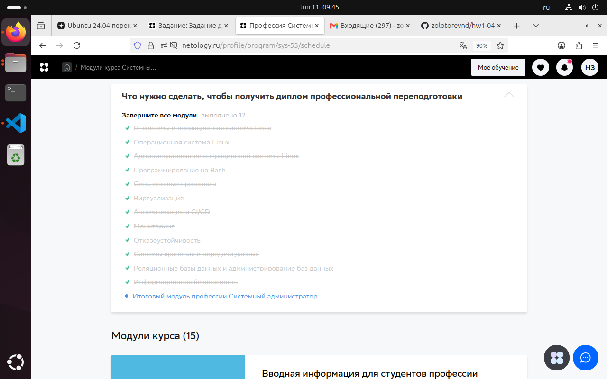

### Для получения доступа к дипломной работе ответьте, пожалуйста, на несколько вопросов.

### 1. Получилось ли у вас загрузить в личный кабинет документы, подтверждающие личность, и диплом о высшем или среднем специальном образовании?

Да. 

### 2. Нужна ли вам справка об обучении после сдачи дипломной работы? Справка выдаётся всем студентам, в том числе тем, у кого нет диплома о высшем или среднем специальном образовании.

Да.

### 3. Выполнен ли вами необходимый минимум заданий на каждом модуле профессии для допуска к дипломной работе?

Да.

